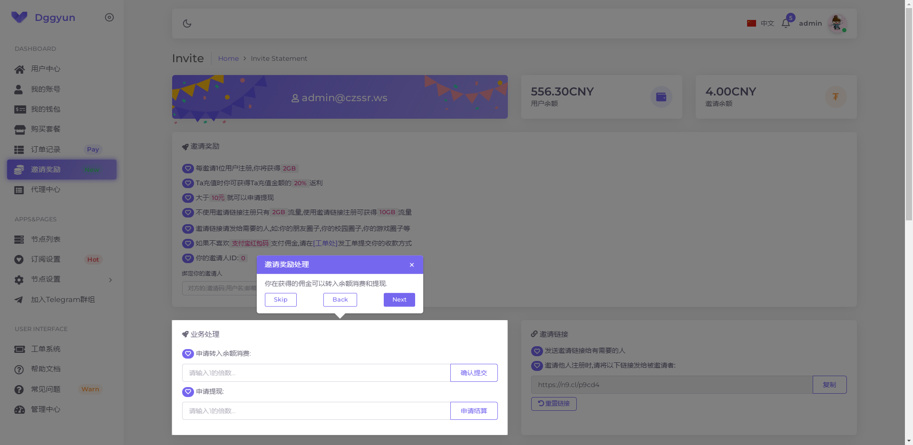
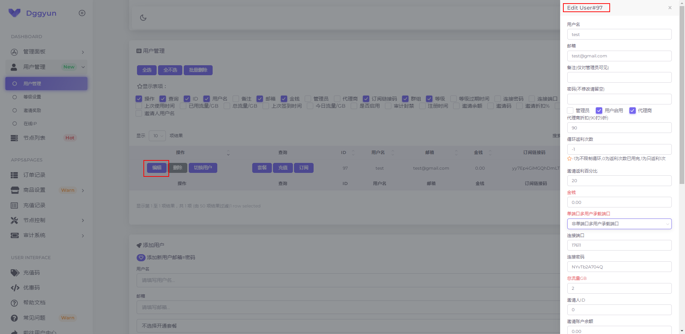
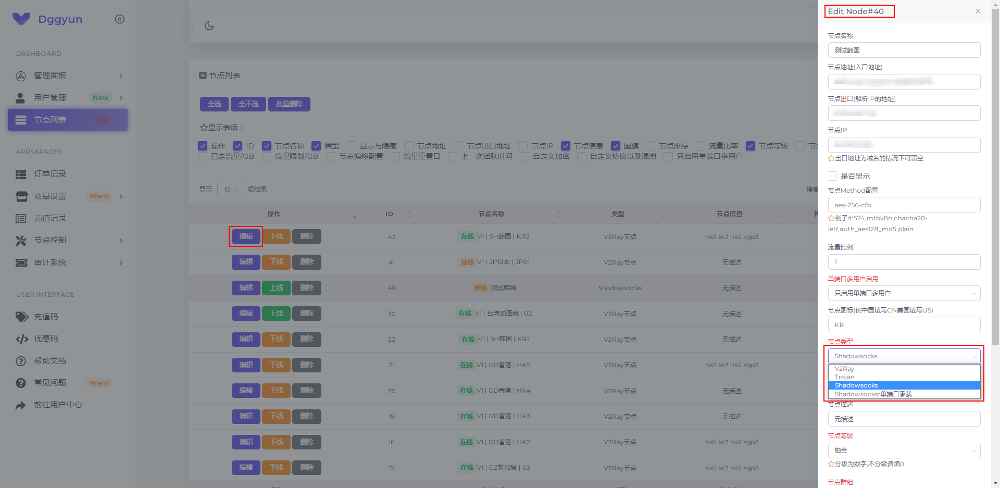
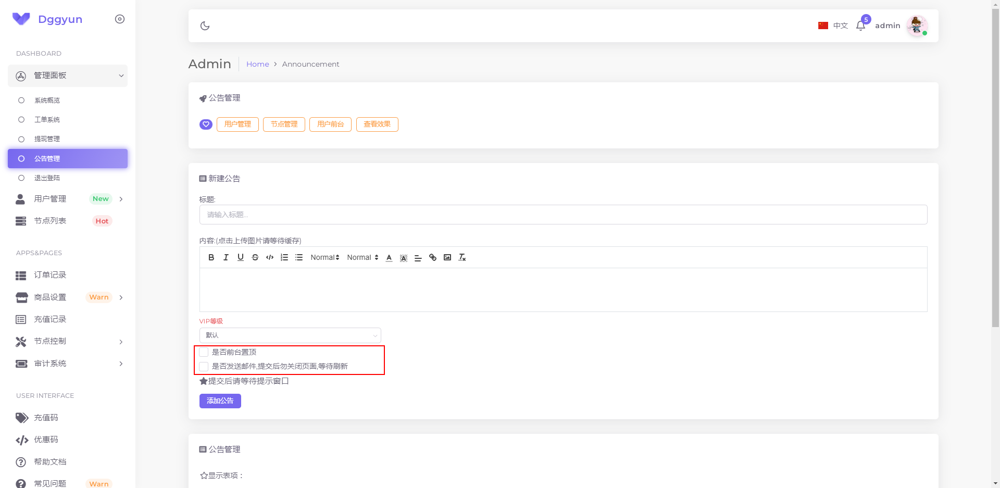
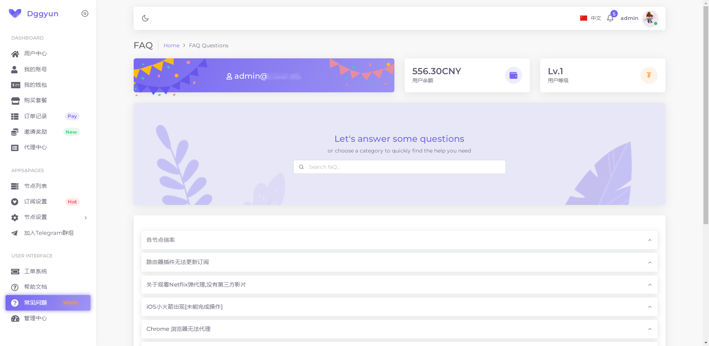
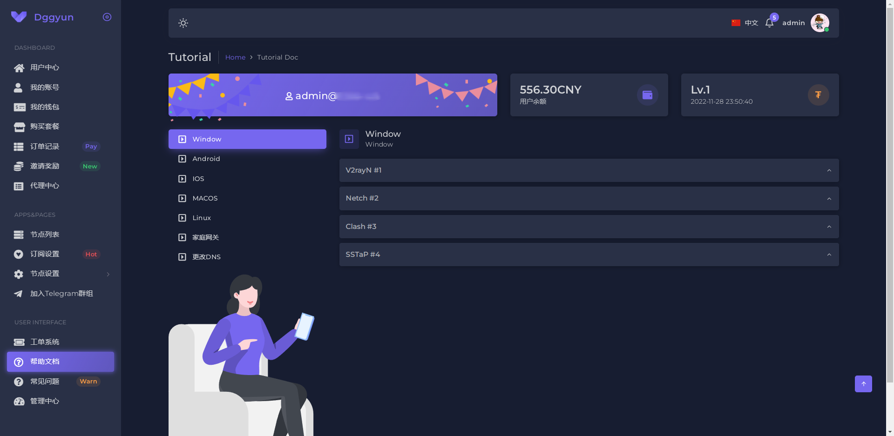

## SSPanel 主题

 

## Vuexy 版本
- [演示站运营ing...](https://dggyun.com)
- <dt>账号: test@gmail.com</dt>
- <dt>密码: 123456abc</dt>

- views/vuexy
  - admin
    - [index.html](vuexy/admin/index.png)
    - [index_dark.html](vuexy/admin/index_dark.png)
  - auth
    - [login.html](vuexy/login.png)
    - [login_dark.html](vuexy/login_dark.png)
    - [register.html](vuexy/register.png)
    - [register_dark.html](vuexy/register_dark.png)
  - password
    - [reset.html](vuexy/password_reset.png)
    - [reset_dark.html](vuexy/password_reset_dark.png)
    - [token.html](vuexy/reset_token.png)
    - [token_dark.html](vuexy/reset_token_dark.png)
  - user
    - [agent.html](vuexy/user/agent.png)
    - [agent_dark.html](vuexy/user/agent_dark.png)
    - [index.html](vuexy/user/index.png)
    - [index_dark.html](vuexy/user/index_dark.png)
    - [index_english.html](vuexy/user/index_english.png)
    - [index_english_dark.html](vuexy/user/index_english_dark.png)
- [index.html](vuexy/index.png)
- [index_dark.html](vuexy/index_dark.png)

### 全局功能
<dt>支持中英文切换</dt>
<dt>夜间和日间主题切换</dt>
<dt>User页面和Admin页面都是统一主题优化</dt>
<dt>(Oauth2.0)Telegram、Github、Google快捷登陆和 快捷注册</dt>

<dt>丰富的邀请奖励/新手引导设计</dt>

<dt>快捷的编辑资料</dt>

<dt>丰富的公告管理</dt>

<dt>常见问题FAQ和帮助教程助力客户尽快上手</dt>

### 联系Telegram
[@SurTimi](https://t.me/SurTimi)
<dt>Email: binbin99138@gmail.com</dt>
