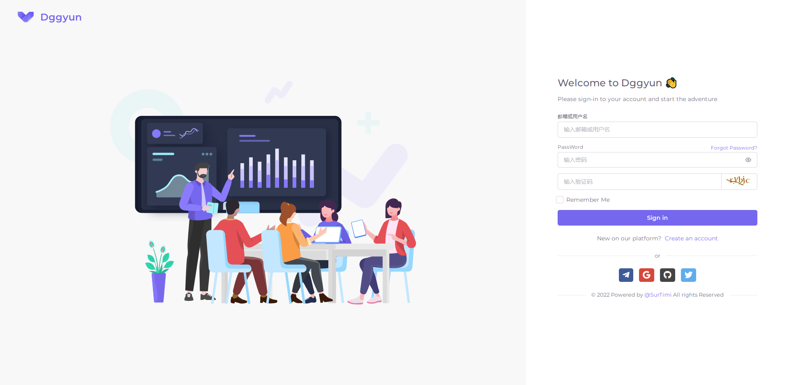
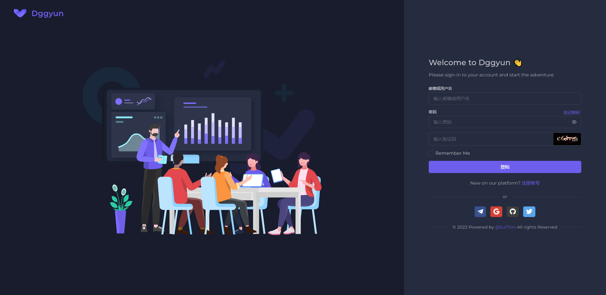

# SSPanel 主题

 

# Vuexy 版本
- [<dt>演示站(运营ing...)</dt>](https://dggyun.com)
- 账号: test@gmail.com
- 密码: 123456abc

- views/vuexy
  - admin
  - auth
    - [login.html](vuexy/login.png)
    - [login_dark.html](vuexy/login_dark.png)
    - [register.html](vuexy/register.png)
    - [register_dark.html](vuexy/register_dark.png)
  - password
    - [reset.html](vuexy/password_reset.png)
    - [reset_dark.html](vuexy/password_reset_dark.png)
    - [token.html](vuexy/reset_token.png)
    - [token_dark.html](vuexy/reset_token_dark.png)
  - user
    - [agent.html](vuexy/user/agent.png)
    - [agent_dark.html](vuexy/user/agent_dark.png)
    - [bought.html]
    - [bought_dark.html]
    - [index.html](vuexy/user/index.png)
    - [index_dark.html](vuexy/user/index_dark.png)
    - [index_english.html](vuexy/user/index_english.png)
    - [index_english_dark.html](vuexy/user/index_english_dark.png)
- [index.html](vuexy/index.png)
- [index_dark.html](vuexy/index_dark.png)

#### 全局功能
*   <dt>(Oauth2.0)</dt>Telegram、Github、Google快捷登陆和 快捷注册
*   夜间和日间主题切换
*   支持中英文切换

#### Login page
*   包含Telegram、Github、Google快捷登陆(Oauth2.0)

